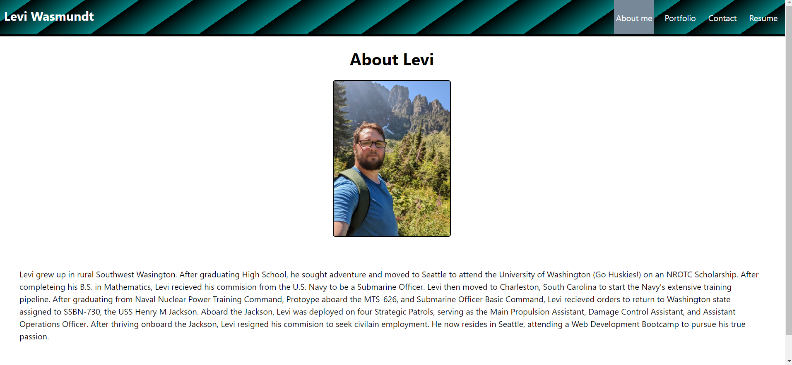
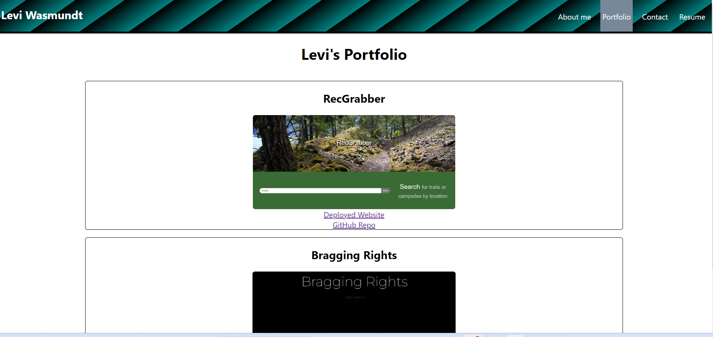

# React Portfolio

## Link to deployed website:

https://wasmulb.github.io/react-portfolio/

## Website Screenshot:

## Description

For this assignment, I created a portfolio page using React. Since this was my first project I learned a lot. My portfolio is simple; it contains four pages: an about section, a contact section, a resume section, and a projects section. I learned to use react routes and implemented them into my navigation bar. The contact has the most features built in. It rejects emails if not the correct format, and will not allow a submission unless all fields are filled out.

This portfolio is a work in progress. I would like to improve the styling of it. Styling without guidance is one of my weak areas, and hope to use this portfolio as a project to learn and improve styling tecniques.

## License

The MIT License was used for this assignment.